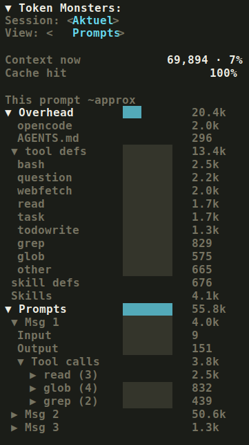

# Token Monsters for OpenCode

Token Monsters adds a token usage sidebar to OpenCode. It shows the current context size, cache hit percentage, session totals, current prompt totals, prompt/tool/file breakdowns, and tool-definition overhead.

All numbers are approximate and counted with `gpt-tokenizer` using the OpenAI o200k tokenizer. For Claude, Copilot, and other non-OpenAI models, treat the numbers as a ballpark.



## Install

Add the plugin to both OpenCode config files.

`~/.config/opencode/opencode.json`

```json
{
  "$schema": "https://opencode.ai/config.json",
  "plugin": [
    "@aundal/opencode-token-monsters@latest"
  ]
}
```

Restart OpenCode after saving. OpenCode installs npm plugins automatically at startup.

`~/.config/opencode/tui.json`

```json
{
  "$schema": "https://opencode.ai/tui.json",
  "plugin": [
    "@aundal/opencode-token-monsters@latest"
  ]
}
```

## Install with OpenCode

Paste this prompt into OpenCode:

```text
Install the OpenCode plugin @aundal/opencode-token-monsters@latest into my global opencode.json and tui.json plugin arrays. Preserve my existing config, validate config shapes against https://opencode.ai/config.json and https://opencode.ai/tui.json, and tell me to restart OpenCode when done.
```

## Usage

Token Monsters appears in the session sidebar.

Use `/tokenmonster` to hide or show the sidebar panel.

## Views

- `Session: Total` shows everything captured since the session started.
- `Session: Aktuel` shows the last request only.
- `View: Prompts` groups usage per prompt turn.
- `View: Tools` aggregates tool and file usage.

## Package

The package exports one OpenCode plugin module with both server and TUI hooks. The server hook writes token capture data, and the TUI hook renders the sidebar.

## Development

```sh
bun install
bun run build
npm pack
```

## Publish

```sh
npm publish --access public
```

## License

MIT
